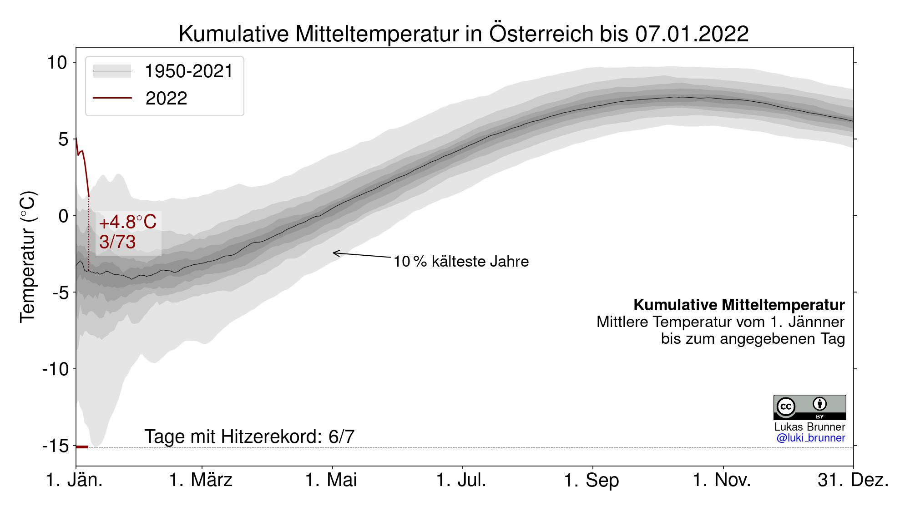

# tas to date

<a href="https://twitter.com/tas_to_date">View o **Twitter**.</a>

**Idea.** The name tas to date is a combination of the common variable name `tas` for near-surface air temperature in climate models and the concept of <a href="https://en.wiktionary.org/wiki/year-to-date" target="_blanck">year-to-date</a> relating to the period from the beginning of the year to a set point during the year.

**Description.** The collection of scripts in this repository mainly creates two kinds of plots
- timeseries of daily temperature in a given region compared to the daily climatology in the same region
- timeseries of daily cumulative (year-to-date) mean temperature also compared to the climatology. Cumulative mean temperature is the temperature from January 1st until each day during a year. So for January 1st it is equivalent to daily temperature by definition and for December 31st it is equivalent to annual mean temperature.

<br>
<br>

**Basic Usage.** For pre-processed data (also termed in sample data) covering the years 1950-2020 the `main.py` script should work out of the box if all required packages are installed. Just run

```bash
python main.py -h
```

for a list of possible parameters. The default year is the current year, so for the basic version this needs to be set to a non-default value. By default the script will currently create plots for all days of the year and all regions, which is quite a few files. Regions can manually be included using the `-r` flag repeatedly. Possible regions currently are: 'global', 'global-land', 'europe', 'europe-land', 'wce-land' (Western Central Europe), and 'austria'. For example try:

```bash
python main 2020 -r global
```

Plots will be saved in the `figures` directory.

**Advanced Usage.** The "operational" part of tas\_to\_date includes downloading near real time ERA5 data (out of sample data) using a separate routine (to be linked soon) and processing them on the fly. The `tweet_*.py` routines are then used to tweet specified plots on Twitter.
